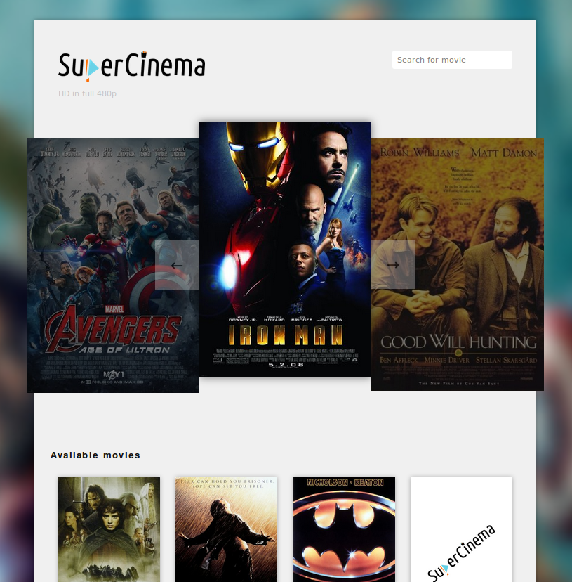

# Super cinema
> *Greatest cinema service in the universe!

## Features

- React front-end
- ExpressJS server with MongoDB for data storage
- Search results update instantly
- Movie carousel
- Comments from annonymous and registered users
- Login and register functionality
- Redux data storage

## How to setup local environment

- Install NodeJS and NPM
- Install MongoDB
    > https://www.mongodb.com/download-center#community
- Clone the repository
- Run `npm install`
- Run `npm run webpack-client` and `npm run webpack-server`
- Run mongoDB server with `--dbpath` of the `db/` folder in project root
    > ex. `mongod.exe --dbpath "path/to/project/db"`
- Run `node initializeDB.js` to initialize the mongoDB
- Run `npm run start`
- Visit the site on `localhost:8080`

## Technologies used

- ReactJS
- PureCSS
- Webpack
- SASS
- MongoDB
- Redux
- ExpressJS

## Credits

Author: Kristaps Keselis
Date:   07/2016
